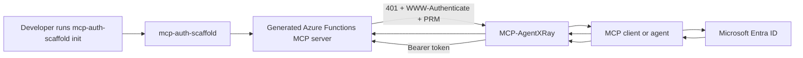

# mcp-auth-scaffold

`mcp-auth-scaffold` is a Node.js + TypeScript CLI that generates an Azure Functions custom-handler MCP server with Microsoft Entra-aware auth plumbing already wired in.

It exists to remove one of the biggest adoption bottlenecks in remote MCP on Azure: developers should not have to hand-build the `401` challenge, Protected Resource Metadata discovery endpoints, and JWT validation layer before they can write their actual tool logic.

## Why this exists

Remote MCP on Azure Functions is getting real traction, but the security story is still awkward for most developers:

1. Create the Azure Function.
2. Figure out Microsoft Entra app registration details.
3. Hand-build a `401 Unauthorized` response with the correct `WWW-Authenticate` metadata.
4. Expose Protected Resource Metadata so the client knows where to get a token.
5. Validate Entra-issued bearer tokens before the MCP tool logic runs.

That plumbing is repetitive, security-sensitive, and easy to get wrong.

`mcp-auth-scaffold` turns that into a generator.

## What the CLI generates

Run one command and the scaffold creates an Azure Functions MCP server that already includes:

- `401` challenge handling with `WWW-Authenticate`
- `/.well-known/oauth-protected-resource`
- `/.well-known/oauth-authorization-server`
- bearer token extraction
- JWT validation against Microsoft Entra JWKS
- a protected MCP endpoint
- a protected REST smoke-test endpoint
- sample tool logic so the generated app is immediately testable

## The big idea

This project is the **developer-experience layer** for secure remote MCP on Azure Functions.

| Layer | Responsibility |
|---|---|
| Azure Functions + MCP platform | Runs the remote MCP server |
| `mcp-auth-scaffold` | Generates the auth wrapper and project structure |
| `MCP-AgentXRay` | Verifies and visualizes the auth handshake |

The result is a clean loop:

1. **Scaffold** the secure server
2. **Run** it locally or in Azure
3. **Inspect** the handshake with MCP-AgentXRay

## Architecture at a glance



## What is happening during the auth handshake

When a client hits the generated MCP route without a token:

1. the server returns **`401 Unauthorized`**
2. the response includes a **`WWW-Authenticate`** header
3. that header includes **`resource_metadata`**
4. the client discovers:
   - the protected resource metadata document
   - the authorization server metadata document
   - the expected audience and scope
5. the client gets an Entra token
6. the client retries with `Authorization: Bearer <token>`
7. the generated middleware validates the token before any MCP tool logic runs

## Example generated handshake behavior

The generated server returns a challenge shaped like this:

```http
HTTP/1.1 401 Unauthorized
WWW-Authenticate: Bearer resource_metadata="http://localhost:7071/.well-known/oauth-protected-resource", authorization_uri="https://login.microsoftonline.com/<tenant>/oauth2/v2.0/authorize", resource="api://<app-id>", scope="Mcp.Access"
```

And the response body includes:

```json
{
  "error": "unauthorized",
  "message": "Missing bearer token.",
  "resource_metadata": "http://localhost:7071/.well-known/oauth-protected-resource"
}
```

That is the key bridge between an unauthenticated MCP request and an Entra-aware retry flow.

## Visual validation with MCP-AgentXRay

The generated server pairs naturally with `MCP-AgentXRay`, which lets you watch the handshake instead of guessing where it failed.

In the dashboard, you can see:

- the incoming MCP request
- the `401` challenge
- the `WWW-Authenticate` header
- the Protected Resource Metadata URL
- the stage progression of the auth flow

## Quick start

### Build the CLI

```bash
npm install
npm run build
```

### Generate a new server

```bash
node dist/index.js init D:\my-secure-mcp-server
```

For non-interactive generation:

```bash
node dist/index.js init D:\my-secure-mcp-server --yes --skip-install
```

## Prompts captured by `init`

The CLI asks for the minimum set of auth values needed to scaffold the server:

- project name
- Entra tenant ID
- app/client ID
- audience / application ID URI
- scope or app role
- base path
- whether to include a sample protected MCP tool

## What the generated project looks like

```text
src/
  auth/
    challenge.ts
    middleware.ts
    prm.ts
    token.ts
  config.ts
  index.ts
function-route/
  function.json
host.json
local.settings.json
.env.example
README.md
```

### Key generated files

| File | Purpose |
|---|---|
| `src/auth/challenge.ts` | Builds the `401` response and `WWW-Authenticate` header |
| `src/auth/prm.ts` | Exposes protected resource metadata and auth server metadata |
| `src/auth/token.ts` | Extracts and validates bearer tokens against Entra JWKS |
| `src/auth/middleware.ts` | Protects MCP and REST routes before business logic runs |
| `src/index.ts` | Wires Express, MCP transport, metadata routes, and protected endpoints |
| `host.json` + `function-route/function.json` | Configures Azure Functions custom-handler hosting |

## Local demo flow

The scaffold was validated locally with this workflow:

1. generate a fresh Azure Functions MCP server from the CLI
2. install dependencies
3. run the server with Azure Functions Core Tools
4. point `MCP-AgentXRay` at `http://localhost:7071`
5. trigger a request to `/mcp`
6. verify:
   - `/.well-known/oauth-protected-resource` returns `200`
   - `/.well-known/oauth-authorization-server` returns `200`
   - unauthenticated `/mcp` returns `401`
   - unauthenticated `/api/sample-status` returns `401`

## How to use this with MCP-AgentXRay

Start the generated server:

```powershell
Set-Location D:\my-secure-mcp-server
npm install
npm start
```

Then start `MCP-AgentXRay` against it:

```powershell
Set-Location C:\path\to\MCP-AgentXRay
$env:TARGET = "http://localhost:7071"
npm start
```

Open the dashboard:

```text
http://localhost:3000/__inspector
```

Now send a request to the generated MCP server through AgentXRay and inspect the `401` + PRM flow visually.

## What still needs real Azure configuration

This scaffolder intentionally does **not** fake tenant-side security setup.

You still need to:

1. register or reuse an Entra application
2. set the Application ID URI to match the generated audience
3. expose the scope or app role referenced by the scaffold
4. grant consent to the client that will call the server
5. configure the same values in Azure Functions when you deploy

The goal is to generate the code correctly while keeping Azure-side TODOs explicit.

## Scripts

- `npm run build`
- `npm test`

## Repository purpose

This repository is not trying to replace Azure Functions or MCP itself.

It is trying to make **secure remote MCP on Azure Functions feel like a one-command starting point** instead of a multi-hour auth wiring exercise.
